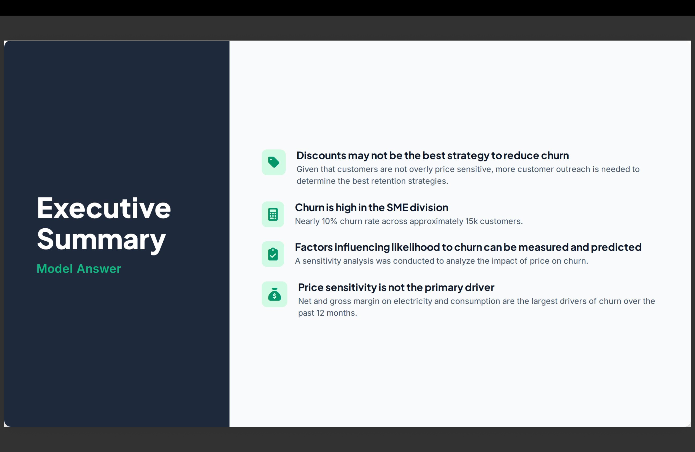

# ⚡ BCG X Data Science Simulation: SME Customer Churn Model

> Predictive churn modeling and price sensitivity analysis for SME utility clients using Pandas and Scikit-Learn.

---

## 📊 Summary Preview

---

## 📌 Project Highlights
* **Data Pipeline:** Merged 14,600+ SME records with 193,000+ pricing logs via Pandas to build a predictive churn modeling pipeline.
* **Machine Learning:** Engineered time-series features and trained a Scikit-Learn Random Forest Classifier, achieving 82.6% precision.
* **Business Synthesis:** Delivered an executive summary showing margins drive the 9.7% churn rate, advising against blanket discounts.

---

## 🚀 Key Metrics
* **Records Analyzed:** 14,600+ SME records & 193,000+ pricing logs
* **Model Precision:** 82.6%
* **Baseline Churn:** 9.7%

---

## 🛠️ Tech Stack
* **Data Engineering:** Python, Pandas
* **Machine Learning:** Scikit-Learn (Random Forest)
